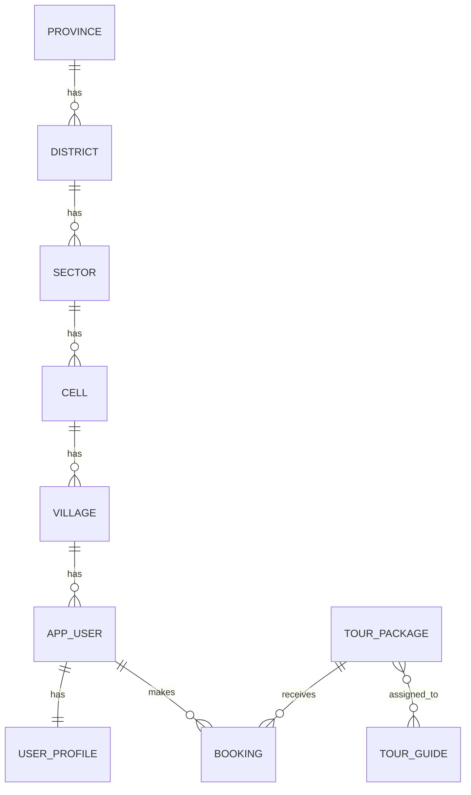

# Presentation Guide

## 1. ERD

## 2. Relationship Logic

- A `Province` contains many `District`s.
- A `District` contains many `Sector`s.
- A `Sector` contains many `Cell`s.
- A `Cell` contains many `Village`s.
- A `User` belongs to one `Village`.
- A `UserProfile` belongs to exactly one `User`.
- A `User` can make many `Booking`s.
- A `TourPackage` can appear in many `Booking`s.
- A `TourPackage` can have many `TourGuide`s and a `TourGuide` can guide many `TourPackage`s.

## 3. Main Idea To Explain

When creating a user, the API only needs `villageCode` or `villageName`.
From that village, the system resolves:

`Village -> Cell -> Sector -> District -> Province`

So the user is not saved directly with province.

## 4. Rubric Mapping

### ERD with 5+ tables

- `Province`
- `District`
- `Sector`
- `Cell`
- `Village`
- `AppUser`
- `UserProfile`
- `TourGuide`
- `TourPackage`
- `Booking`

### Save Location

- Save in order:
  - province
  - district
  - sector
  - cell
  - village

### Sorting and Pagination

- Users, packages, and bookings use `PageRequest` and `Sort`.
- Example:
  - `GET /api/users?page=0&size=10&sortBy=createdAt&direction=asc`
  - `GET /api/packages?page=0&size=5&sortBy=price&direction=desc`
  - `GET /api/bookings?page=0&size=5&sortBy=bookingDate&direction=desc`

### Many-to-Many

- `TourPackage <-> TourGuide`
- Join table: `tour_package_guides`

### One-to-Many

- `Province -> District`
- `District -> Sector`
- `Sector -> Cell`
- `Cell -> Village`
- `Village -> User`
- `User -> Booking`
- `TourPackage -> Booking`

### One-to-One

- `AppUser -> UserProfile`

### existsBy()

- Used for duplicate checking before save:
  - user code
  - user email
  - guide code
  - guide email
  - package code
  - package title
  - booking reference
  - location codes

### Retrieve Users By Province

- `GET /api/users/by-province?provinceCode=<province-code>`
- `GET /api/users/by-province?provinceName=<province-name>`

### Retrieve Users By Other Levels

- `GET /api/users/by-location?cellCode=<cell-code>`
- `GET /api/users/by-location?districtCode=<district-code>`
- `GET /api/users/by-location?villageCode=<village-code>`

## 5. Postman Order

### Location requests

1. `POST /api/locations/provinces`
2. `POST /api/locations/districts`
3. `POST /api/locations/sectors`
4. `POST /api/locations/cells`
5. `POST /api/locations/villages`

### User requests

6. `POST /api/users`
7. `GET /api/users`
8. `GET /api/users/{id}`
9. `GET /api/users/by-province?...`
10. `GET /api/users/by-location?...`

### Guide requests

11. `POST /api/guides`
12. `GET /api/guides`

### Package requests

13. `POST /api/packages`
14. `GET /api/packages?page=0&size=5&sortBy=price&direction=desc`

### Booking requests

15. `POST /api/bookings`
16. `GET /api/bookings?page=0&size=5&sortBy=bookingDate&direction=desc`

## 6. Data Setup Message

State this clearly during presentation:

- The application does not ship with fixed demo records.
- All data is created manually through the CRUD endpoints.
- Postman variables or saved IDs are used only to chain requests after creation.

### Good demo queries after you create data

- `GET /api/users/by-province?provinceCode=<province-code>`
- `GET /api/users/by-location?cellCode=<cell-code>`
- `GET /api/users/by-location?districtCode=<district-code>`
- `GET /api/users/by-location?villageCode=<village-code>`

## 7. One-Sentence Viva Summary

This project stores each user at the village level and uses JPA relationships to resolve cell, sector, district, and province dynamically for retrieval, filtering, pagination, sorting, and booking operations.
